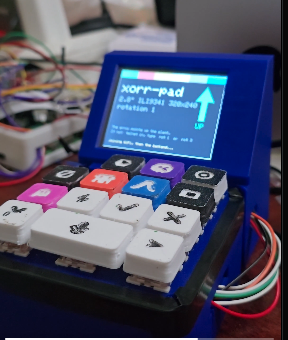

# xorrpad

**Wall Street closes. Your desk doesn't.**

A physical trading terminal for tokenized stocks. Fourteen keys, a knob, a
microphone and a 2.8" panel, sitting next to your keyboard — quoting NVDAx at
3am on a Sunday, when the exchange that prices NVDA has been shut for 40 hours.

Two thirds of tokenized-equity volume happens while the underlying listing is
closed. That gap is the entire product.



---

## What it does

Press a key, and an agent proposes a trade. The proposal goes through a gate
built only from what the pad remembers — your risk limits, your allowlist, what
you already hold, what you have already spent today, and the rules it learned
from your own past refusals. If the gate allows it, the panel asks you to
confirm.

Press ✓ and it builds the transaction. **It does not sign it.** See
[Signing](#signing).

```
  ┌─────────────────────────────────────────────┐
  │ NVDAx           [SOLANA]      [ARMED]       │
  │ momentum  -  $50 of $300 today              │
  │                                             │
  │  $223.64                  +1.70% 24h        │
  │                              +12.40 unreal. │
  │       ╱╲    ╱╲      ╱╲   ╱                  │
  │   ╱╲╱  ╲__╱   ╲___╱  ╲_╱                    │
  │ ───────────────────────────────────────     │
  │ WEEKEND                        15:17 NY     │
  │ shut on the NYSE - this trades anyway       │
  └─────────────────────────────────────────────┘
```

The bottom bar is never absent and never subtle. A screen that showed a price
without saying which of those two worlds it came from would be implying the
exchange is open.

---

## Two venues, one deck

| | chain | venue | what it trades |
|---|---|---|---|
| **Solana** | mainnet | Jupiter | 17 Backed Finance xStocks — SPYx, NVDAx, TSLAx, AAPLx … |
| **X Layer** | 196 | OKX DEX aggregator | WOKB, USDT, USDC, WETH |

```bash
CHAIN=solana ./desk/run.sh      # default
CHAIN=xlayer ./desk/run.sh
```

Same keys, same gate, same memory, same screen. The venue is a module with
seven functions on it (`chains/index.mjs`); nothing above that layer knows which
chain it is talking to.

---

## The book is measured, not assumed

Searching Jupiter for `TSLAx` returns three tokens:

```
TSLAx  XsDoVfqeBukxuZHWhdvWHBhgEHjGNst4MLodqsJHzoB   $1,261,725   real
TSLAx  EaxDDrLr3P2txZmgAgwaKD7sGSoZY4EZM9xFgtTbpump  $    3,110   impostor
TSLAx  HMMxrskwSnXrMwX4xG6MTAnQ9BG3LPcJCeE2tsjtpump  $    2,953   impostor
```

Every genuine xStock carries Backed's `Xs` mint prefix; no impostor did. So the
mints are **hardcoded** and the pad never resolves a ticker to an address at
runtime. A symbol is not an identity, and getting it wrong means buying a
worthless copy of Tesla.

Then each market was quoted at $50 and again at $500, because a pool existing is
not a pool being tradeable:

```
symbol   $50       $500      impact     verdict
SPYx     768.04    768.06     0.00%     listed
NVDAx    221.60    221.67     0.03%     listed
NFLXx    736.96    743.91     0.94%     listed — thin but real
JPMx     374.67   4124.79  1000.92%     REJECTED
```

JPMx is why the check exists: $1,453 of liquidity behind a ticker that looks as
legitimate as the rest, and a $500 order that pays eleven times the going rate.
It is excluded by name, with the reason kept in the file.

---

## Signing

**The pad holds no key. Neither venue can execute.**

It quotes, it prices, it reads balances, it reasons, and it builds an unsigned
transaction. Then it stops. `chains/index.mjs` asserts this at startup rather
than trusting it, and `test/verify.mjs` checks the CLI is only ever handed
read-only verbs and the RPC only read methods.

That is not a limitation dressed up as a feature. This is a device that sits on
a desk within reach of anyone walking past it, and the X Layer account behind it
is funded with real money on mainnet. A trading terminal must not be one
keypress from spending a balance.

On ✓ the trade is **re-quoted at that moment** rather than reused from the
proposal — seconds have passed, and on a market that trades while its exchange
is shut, that is exactly when a price moves. It is journalled as `HANDED_OFF`,
never as filled, because the pad does not watch for that signature and must not
claim an outcome it cannot see.

---

## Memory is load-bearing

The gate is built from memory and nothing else. Wipe the store and the agent
keeps working, but it forgets your limits, forgets what you hold, and forgets
the rules you taught it — so it shrinks to a timid version of itself
(`$10/trade` instead of `$100`) rather than carrying on at full size.

```
signal            WITH memory                          WITHOUT memory
A  ETH buy $80    REJECT   vetoed by a rule you taught EXECUTE $10  clamped
B  ETH buy $30    EXECUTE $30                          EXECUTE $10  clamped
C  ETH sell $30   EXECUTE  position remembered         REJECT   cannot see the bag
D  ETH buy $8     EXECUTE $8    ← control, unchanged   EXECUTE $8
```

`node desk/test/loadbearing.test.mjs` asserts that three of four change and the
control does not.

---

## Running it

```bash
# 1. the desk backend  (Node 20+, no build step)
cd desk && npm install && ./run.sh
#    -> xorrpad backend on http://0.0.0.0:8080  (Solana, quotes only, auth on)

# 2. the browser view
open "http://localhost:8080/?token=xorrpad-dev"

# 3. check it end to end, against the live venues
node test/verify.mjs          # 49 checks, nothing mocked
```

The pad itself joins over Wi-Fi and points at the same URL — its captive portal
asks for the address and token, so there is no firmware rework to move it
between machines.

### The screen, without a board

`firmware/xorrpad/ui.h` is every pixel the pad draws and nothing that knows
about hardware, so it compiles on a laptop:

```bash
cd tools/uipreview && make open      # renders the real frames to PNGs
```

Three layout bugs came straight out of looking at those PNGs: a UTF-8 middot
rendering as line noise in an ASCII-only font, the hours bar running off the
right edge of a 320px panel, and the gate's reasoning truncating one word before
"anyway".

---

## Layout

```
firmware/xorrpad/     ESP32-S3 sketch — 4×4 matrix, I2S mic + amp, ILI9341
  ui.h                every pixel; no SPI, no WiFi, host-renderable
  display.h           the device: SPI, panel, PSRAM canvas, one blit per frame
  padstate.h          what the pad knows, as plain data
desk/
  main/chains/        solana.mjs (Jupiter) · xlayer.mjs (OKX) · index.mjs
  main/xstocks.mjs    the verified book, and when the NYSE is shut
  main/decide.mjs     the gate — memory in, verdict out
  main/memory.mjs     Sibyl, over a Python sidecar
  renderer/           the desk app
  test/verify.mjs     49 checks against the running product
tools/uipreview/      compile ui.h on a laptop, get PNGs
cad/                  the printable case, parametric, no CSG
```

---

## Known limits

- **X Layer is quote-only.** `onchainos swap swap` would return transaction
  data, but its own help describes itself as "quote → sign → broadcast" and the
  account behind it holds real money on mainnet. It is not called to find out
  which of those it means. Solana builds a full unsigned transaction.
- **Balances need an address.** Set `SOLANA_ADDRESS` to watch a wallet;
  without it the pad quotes and reasons but reports no holdings.
- **The hardware sweep is incomplete.** One key (`RUN`, r2c1) is dead at the
  solder joint and row 3 was never swept. The desk app mirrors every key as a
  button, so a dead switch never blocks a demo.

## Licence

MIT.
